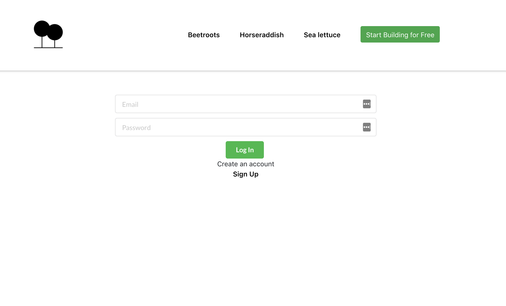
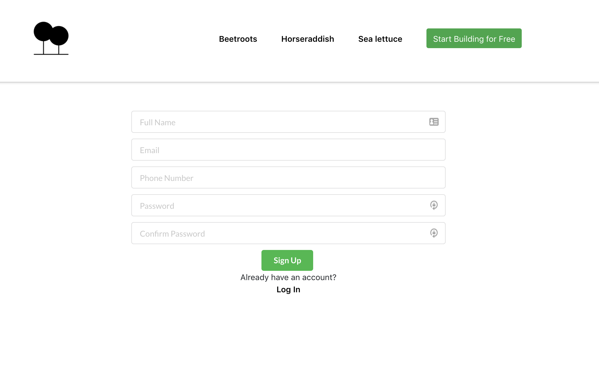
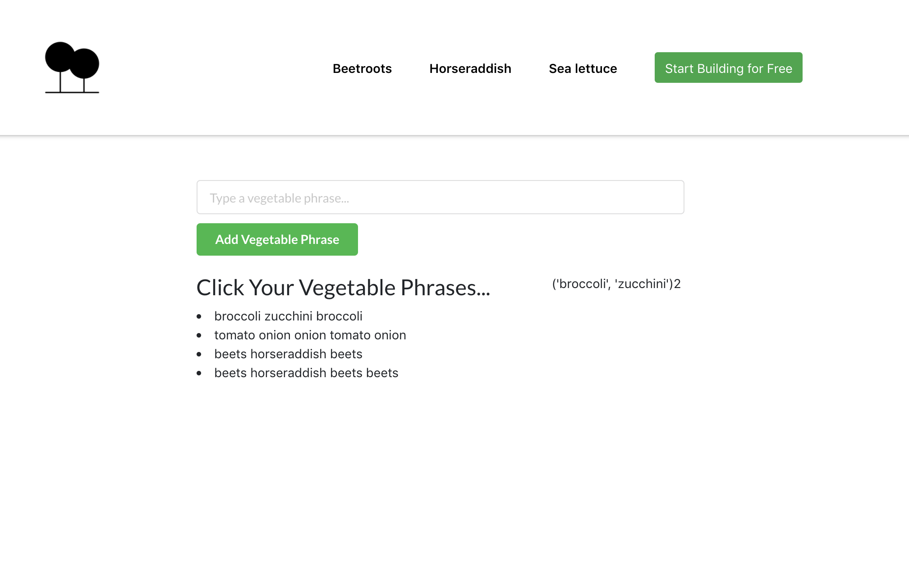
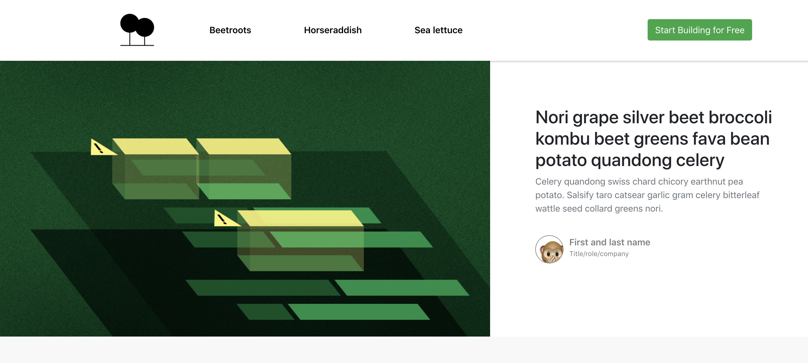
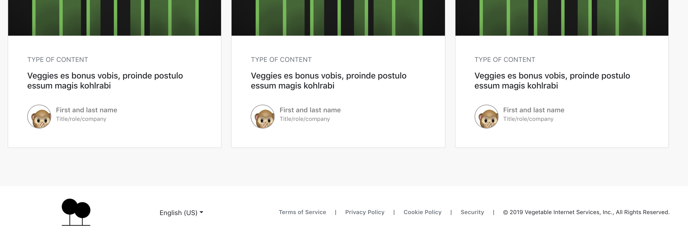
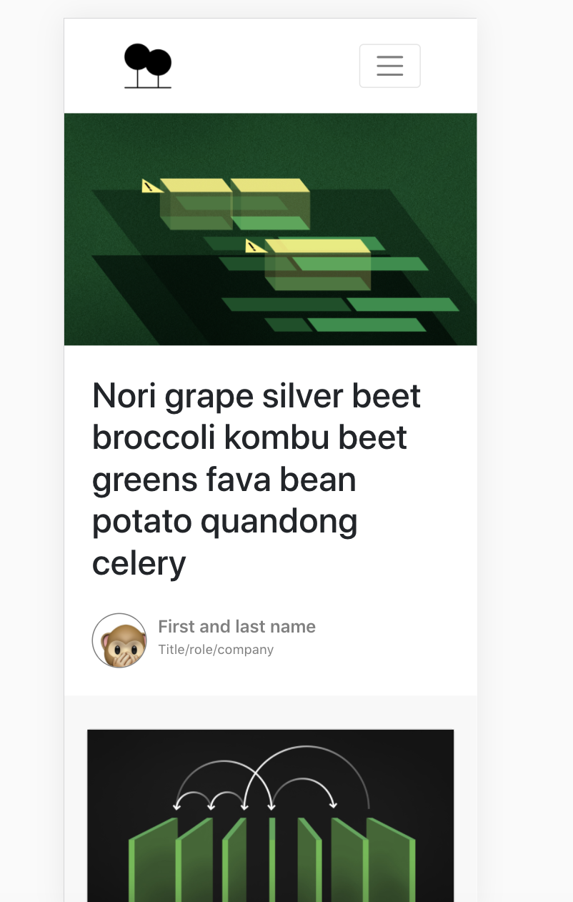
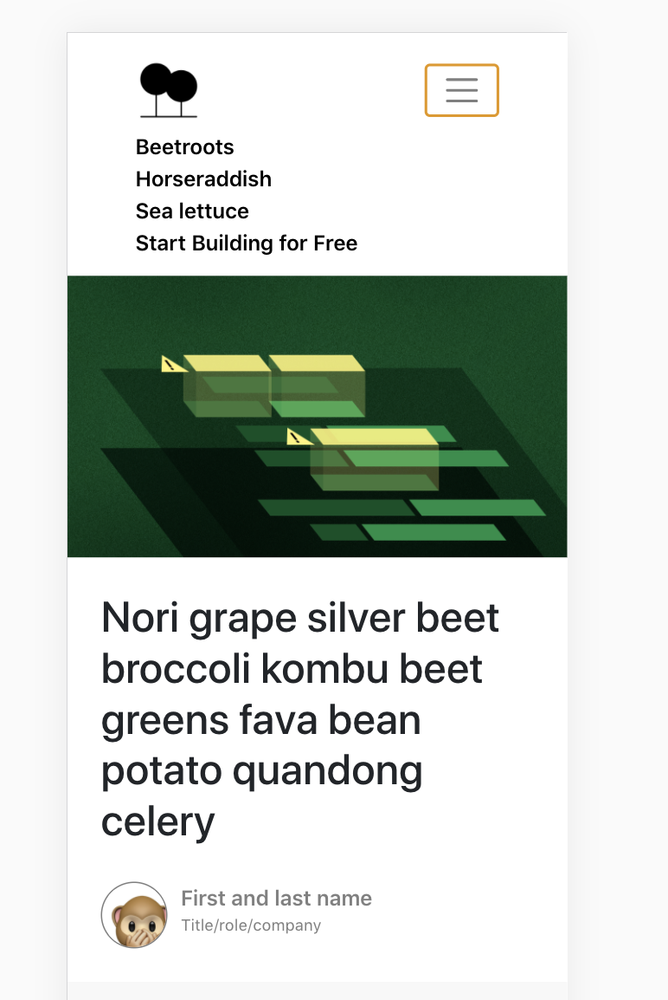
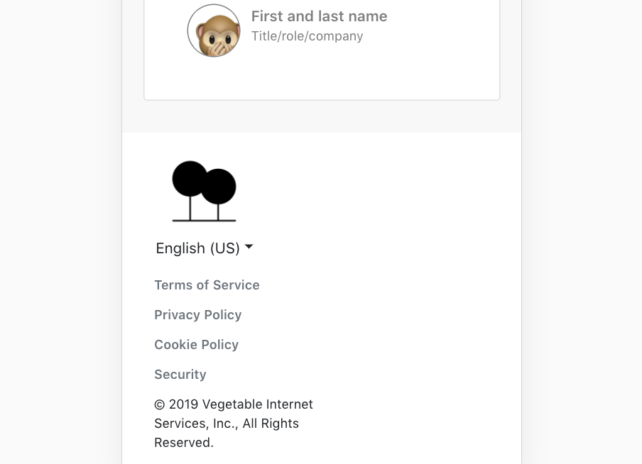
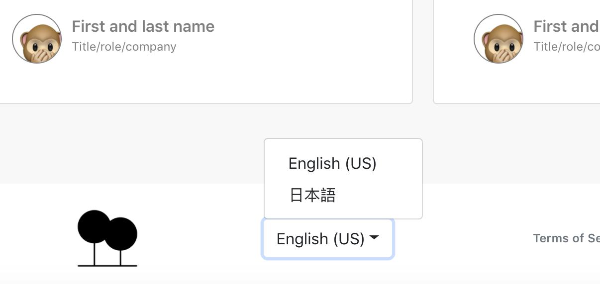

### To Run
1. Create a virtual env and install `requirements.txt`
2. from `api` directory run `flask run`
3. in another terminal window, from `test-flask-react` run `npm start`
4. go to `localhost:3000` in your web browser

### Technologies/Patterns Used

1. Frameworks: React, Flask
2. State Management: MobX
3. Database: Sqlite
4. Cache: Flask_Caching
5. Bundler: Webpack
6. Transpiler: Babel
7. Internationalization: i18n
8. Base Component/Styling Libraries: Boostrap, React-Bootstrap, mdbreact, SegmentUI
9. Test Runner: Jest
10. Styling: BEM, Flexbox

### Routes + Functionality

1. Home: change language of 'start building button' using i18n
2. Phrase: create new phrase, on click of created phrase, generates count of seqential pairs (order agnostic)
3. Signup: shared auth store and config with Login + validation
4. Login: shared auth store and config with Signup + validation

### Components

1. Navbar (displayed in Desktop screen size)
2. MobileNavbar (displayed at breakpoint for Mobile Web)
3. Hero
4. DisplayCards
5. DisplayCard
6. PolicyLinks
7. Footer
8. MonkeyInfo (used on both DisplayCard and Hero)
9. LanguageSelector
10. PhraseForm
11. AuthInput
12. ErrorMessage

I chose to make most stateless components functional for performance while keeping most stateful components class-based to utilize React lifecycle hooks.

### Accessibility

1. Aria-labels and aria-labelledbys with descriptive language
2. Semantic Markup
3. TabIndex
4. Alt text on all Images

### Next Steps

1. create store for phrase functionality
2. break phrase route down into components
3. finishing signup and login routes in the api + store session cookie in local storage
4. hash passwords
5. cache previously fetched phrases

### Screenshots

Login

Signup

Phrase

Home Desktop Upper

Home Desktop Lower

Home Mobile Upper - Nav Closed

Home Mobile Upper - Nav Open

Home Mobile Lower

Home Language Selector

Home Get Started Button - Translated

